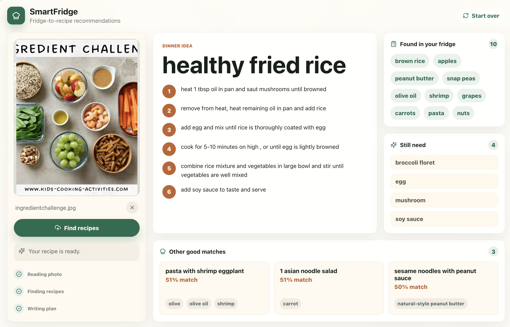

# SmartFridge
> AI-Powered Fridge-to-Recipe Recommendation System

[](https://github.com/StephanieWXYZ/SmartFridge/actions/workflows/ci.yml)

SmartFridge turns a fridge or pantry photo into recipe recommendations. The system
extracts visible ingredients from an image, searches a recipe index with semantic
embeddings, and generates a recipe plan with substitutions and a shopping list.

## Demo

[Watch the SmartFridge demo](https://youtu.be/SP3V6mZnOCo)



## Highlights

- Full-stack fridge-to-recipe app with React, FastAPI, Celery, and Redis
- 3-stage AI pipeline for ingredient extraction, recipe retrieval, and recipe refinement
- Pinecone vector search over OpenAI ingredient embeddings
- Provider fallback handling for unreliable AI responses
- Dockerized web, worker, and queue services
- CI checks for linting, tests, and backend Docker builds
- Deployment configs for AWS ECS/Terraform and Render

## Architecture

```text
Fridge photo
  -> FastAPI upload endpoint
  -> Celery task queue
  -> Ingredient extraction
  -> Pinecone recipe retrieval
  -> AI recipe refinement
  -> React recipe result
```

The backend separates the user-facing API from long-running AI work. FastAPI accepts
the upload and returns a task ID immediately, while Celery workers process the image,
retrieve matching recipes, and generate the final recommendation in the background.

See [SmartFridge Architecture](docs/architecture.md) for more detail.

## Tech Stack

| Area | Tools |
| --- | --- |
| Frontend | React, Vite, TypeScript |
| Backend API | FastAPI, Pydantic |
| Background jobs | Celery, Redis |
| AI services | Gemini, OpenAI |
| Retrieval | Pinecone, OpenAI embeddings |
| Infrastructure | Docker, Docker Compose, Terraform, AWS ECS, Render |
| CI/CD | GitHub Actions |

## Local Development

### Backend

```bash
cd backend
python -m venv .venv
source .venv/bin/activate
pip install -e ".[dev]"
uvicorn app.main:app --reload
```

API docs:

```text
http://127.0.0.1:8000/docs
```

### Frontend

```bash
cd frontend
npm install
npm run dev
```

Frontend app:

```text
http://127.0.0.1:5173
```

### Full Local Stack

To run the API, Celery worker, and Redis queue together:

```bash
cd backend
docker compose up --build
```

## Environment Variables

Copy `backend/.env.example` to `backend/.env` and provide credentials for the AI-backed
workflow.

```bash
cd backend
cp .env.example .env
```

Required for full image-to-recipe generation:

- `GOOGLE_API_KEY`
- `OPENAI_API_KEY`
- `PINECONE_API_KEY`
- `PINECONE_INDEX_NAME`
- `REDIS_URL`

The test suite does not require live AI credentials.

## Testing

```bash
cd backend
python -m ruff check .
python -m pytest
```

```bash
cd frontend
npm run build
```

## Recipe Indexing

Use `backend/scripts/index_recipes.py` to index a CSV or JSONL recipe dataset into
Pinecone with OpenAI embeddings.

```bash
cd backend
OPENAI_API_KEY=... PINECONE_API_KEY=... python scripts/index_recipes.py path/to/recipes.jsonl
```

## Benchmarking

Use `backend/scripts/benchmark_pipeline.py` to measure end-to-end latency across upload,
Celery processing, recipe retrieval, and recipe refinement.

```bash
cd backend
python scripts/benchmark_pipeline.py path/to/fridge.jpg --runs 5
```

See [Benchmarking](docs/benchmarking.md) for the measurement workflow.

## Deployment

SmartFridge is containerized so the same application structure can run locally or in the
cloud.

### AWS ECS

Terraform files in `backend/terraform` define an AWS ECS deployment with separate web,
worker, Redis, load balancer, networking, and log resources. GitHub Actions includes a
deployment workflow for building backend images, pushing to Amazon ECR, and redeploying
ECS services.

See [Deployment](docs/deployment.md) for AWS setup and release steps.

### Render

The repo also includes a `render.yaml` Blueprint for a cost-conscious demo deployment:

- `smartfridge-api`: Docker web service serving the React frontend and FastAPI API
- `smartfridge-worker`: Docker Celery worker
- `smartfridge-redis`: Render Key Value service for the Redis-compatible queue

Render prompts for these secret environment variables during Blueprint setup:

- `GOOGLE_API_KEY`
- `OPENAI_API_KEY`
- `PINECONE_API_KEY`

`PINECONE_INDEX_NAME` defaults to `fridge-ai-recipes`.
